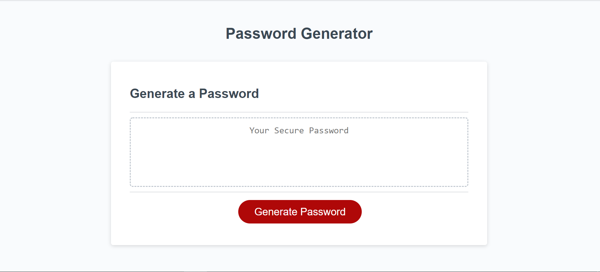
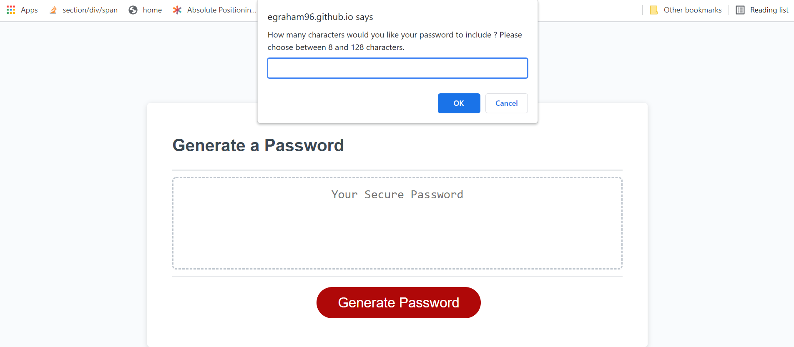

# Homework Assignment 3 - Password Generator

## Description:
This week’s homework requires you to modify starter code to create an application that enables employees to generate random passwords based on criteria that they’ve selected. This app will run in the browser and will feature dynamically updated HTML and CSS powered by JavaScript code that you write. It will have a clean and polished, responsive user interface that adapts to multiple screen sizes. The password can include special characters. If you’re unfamiliar with these, see this [list of password special characters](https://www.owasp.org/index.php/Password_special_characters) from the OWASP Foundation.

## Built With:
* HTML
* CSS
* Javascript

## Deployed Links:
* [See Live Site](https://egraham96.github.io/Random-Password-Generator/)
* [Link to GitHub Repo](https://github.com/egraham96/Random-Password-Generator)
                                                                                        
## Preview of Working Site:

## How to Contribute:
If you'd like to contribute to this project please send an email to eeg4@uw.edu or message me on github: egraham96

## License:

